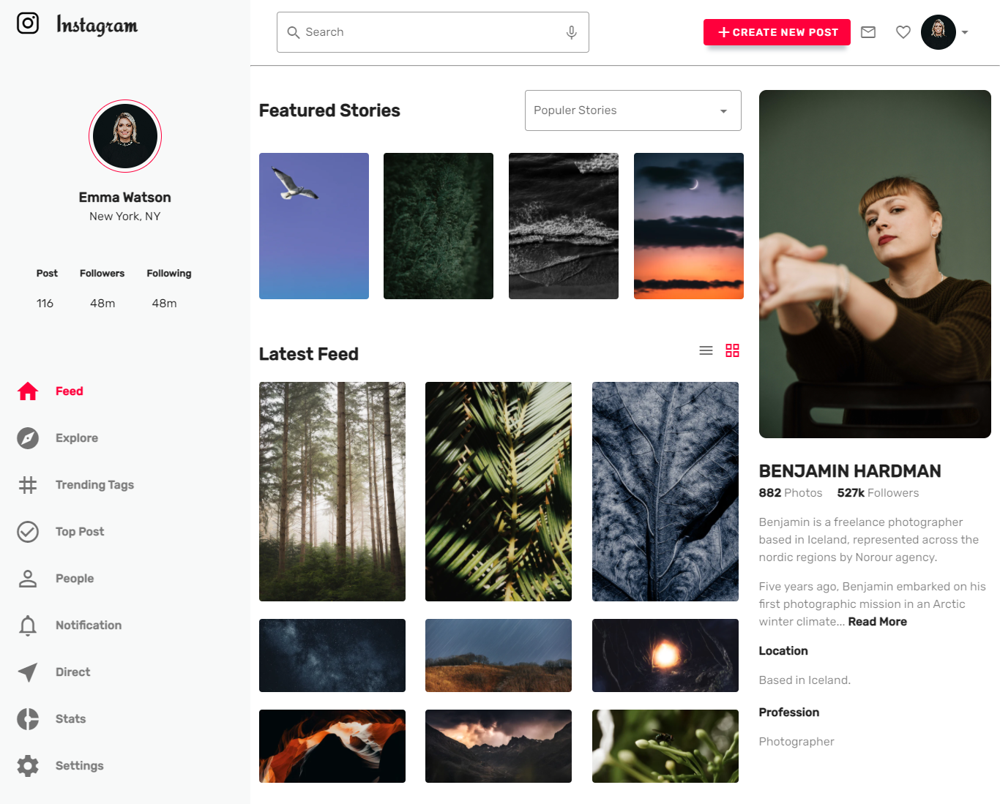

# Instagram Clone With Vuetify

## Requirements
* **[`Design From Masudur Rahman`](https://dribbble.com/shots/5423776-Instagram-Profile-Concept-for-Web)**
* **[`vue cli`](https://cli.vuejs.org/guide/installation.html)**
* **[`vuetify`](https://vuetifyjs.com/en/getting-started/installation/)**

## Getting started
Clone the repository
```
git clone https://github.com/sjasminetya/instagram-clone-vuetify.git
```
Install all dependencies
```
npm install
```
Running
```
npm run serve
```

## Screenshots
<div align="center">
  
</div>
